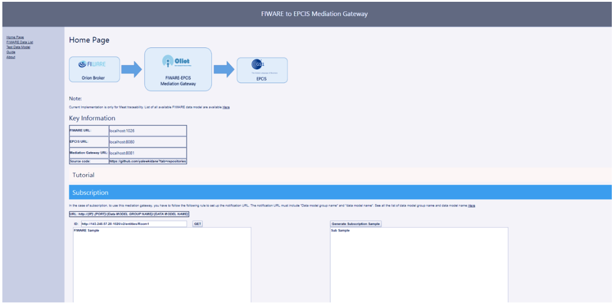
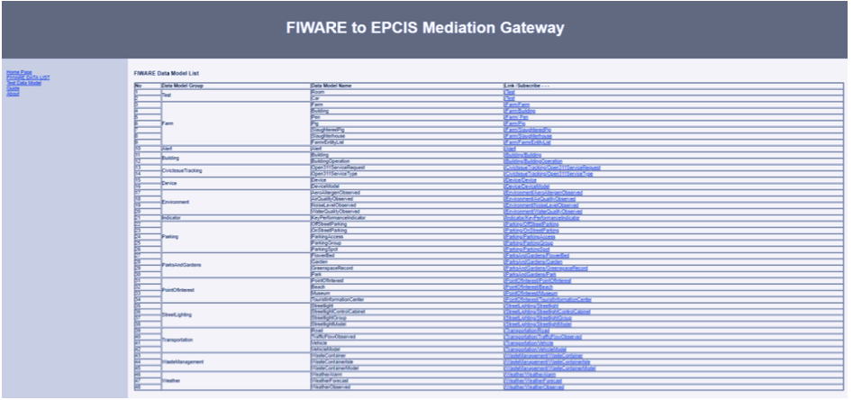
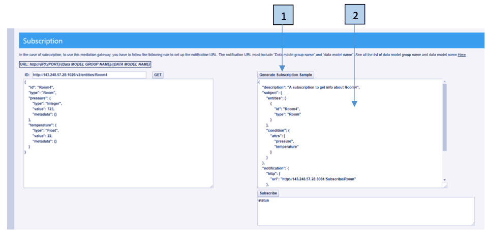

## How to run the mediation gateway

From
`https://github.com/yalewkidane/FIWARE_EPCIS_Mediation_Gateway/blob/master/target/`
download `fiware_oiliot_mediation-0.0.1-SNAPSHOT.jar`

Run with the following command:

```bash
java -jar path/to/your_jar_file/ fiware_oiliot_mediation-0.0.1-SNAPSHOT.jar
```

-   Enter FIWARE server URL (e.g `localhost:1026`) : `localhost:1026`
-   Enter FIWARE server URL (e.g `localhost:8080`) : `localhost:8080`
-   Mediation Gateway Port (e.g `8083`): `8081`

After that, the mediation gateway will run and you can access the interface
through any browser `localhost:<Mediation_Gateway_Port>/home`. From the above
example the url should be `localhost:8081/home`

After that you will see the interfaces presented below

## FIWARE to EPCIS mediation Gateway Interfaces

### Main page

`{IP}:{PORT}/home`



### Fiware Data List

`{IP}:{PORT} /FiwareDataModel`



### Farm Data List example (Schema and example)

`{IP}:{PORT} / farm/pen`


Further examples:

-   `{IP}:{PORT} / farm/farm`
-   `{IP}:{PORT} / farm/building`
-   `{IP}:{PORT} / farm/pig`
-   `{IP}:{PORT} / farm/slaughteredPig`
-   `{IP}:{PORT} / farm/slaougterhouse`
-   `{IP}:{PORT} / farm/entityList`

### Simple Subscription example

&nbsp;1. Check for a specific entities on FIWARE before subscription (eg. Room8)

    - Method GET
    - URL `localhost:1026/v2/entities/Room8`
    - Headers ``Content-Type: application/json`
    -  Status 404 Not Found

#### Response

```json
{
 "error": "NotFound",
 "description": "The requested entity has not been found. Check type
and id"
}
```

Comment Entity Room8 doesn’t exist in FIWARE so we need to create it first

&nbsp;2. Add a Room entity to FIWARE before subscription (eg. Room8)

-   Method POST
-   URL `localhost:1026/v2/entities`
-   Headers `Content-Type: application/json`
-   Body

```json
{
    "id": "Room8",
    "type": "Room",
    "pressure": {
        "type": "Integer",
        "value": 123,
        "metadata": {}
    },
    "temperature": {
        "type": "Float",
        "value": 28,
        "metadata": {}
    }
}
```

#### Response

Status 201 Created. Entity Room8 is created.

```json
{}
```

&nbsp;3. Check the created entity

-   Method GET
-   URL localhost:1026/v2/entities/Room8
-   Headers `Content-Type: application/json`

#### Response

Status 200 OK Entity Room8 created in step 2 is returned

```json
{
    "id": "Room8",
    "type": "Room",
    "pressure": {
        "type": "Integer",
        "value": 123,
        "metadata": {}
    },
    "temperature": {
        "type": "Float",
        "value": 28,
        "metadata": {}
    }
}
```

&nbsp;4. Generate sample subscription.

How to make subscription body refer to :
[How to make subscription URL](https://fiware-orion.readthedocs.io/en/master/user/walkthrough_apiv2/index.html)

To use this mediation gateway, you have to follow the following rule to set up
the notification URL. The notification URL must include "Data model group name"
and "data model name" and it should looks like this:
`http://{IP}:{PORT}/Subscribe/{DATA MODEL GROUP NAME}/{DATA MODEL NAME}`

-   IP: IP address of the mediation gateway
-   Port: port address of the mediation gateway running
-   DATA MODEL GROUP NAME}/DATA MODEL NAME : check
    `http://{IP}:{PORT}//FiwareDataModel`

example:

-   `http://localhost:8081/Subscribe/Test/Room`
-   `http://localhost:8081/Subscribe/Test/Car`
-   `http://localhost:8081/Subscribe/Farm/Building`

#### Sample subscription body

```json
{
    "description": "A subscription to get info about Room8",
    "subject": {
        "entities": [
            {
                "id": "Room8",
                "type": "Room"
            }
        ],
        "condition": {
            "attrs": ["pressure", "temperature"]
        }
    },
    "notification": {
        "http": {
            "url": "http://143.248.57.28:8081/Subscribe/Test/Room"
        },
        "attrs": ["pressure", "temperature"]
    },
    "expires": "2040-01-01T14:00:00.00Z",
    "throttling": 5
}
```

You can use the mediation gateway to generate sample



&nbsp;5. Check if there is epcis event related to Room 8

> Note: During translation sample key is generated as follows
>
> ```
> urn:epc:id:sgtin:88000269.[entityID]
> ```

-   Server [EPCIS ] `localhost:8080`
-   Method GET
-   URL
    `http://localhost:8080/epcis/Service/Poll/SimpleEventQuery?MATCH_epc=urn:e pc:id:sgtin:88000269.Room8`

#### Response

Status 200 OK. Comment It returns empty event list

```xml
<?xml version="1.0" encoding="UTF-8" standalone="yes"?>
<EPCISQueryDocumentType
xmlns:ns2="http://www.unece.org/cefact/namespaces
/StandardBusinessDocumentHeader"
xmlns:ns4="urn:epcglobal:epcis:xsd:1" xmlns:ns3="urn:epcglobal:epcisquery:xsd:1">
 <EPCISBody>
 <ns3:QueryResults>
 <queryName>SimpleEventQuery</queryName>
 <resultsBody>
 <EventList/>
 </resultsBody>
 </ns3:QueryResults>
 </EPCISBody>
</EPCISQueryDocumentType>
```

&nbsp;6. Subscribe

-   Method POST
-   URL localhost:1026/v2/ subscriptions
-   Headers `Content-Type: application/json`
-   Body

```json
{
    "description": "A subscription to get info about Room8",
    "subject": {
        "entities": [
            {
                "id": "Room8",
                "type": "Room"
            }
        ],
        "condition": {
            "attrs": ["pressure", "temperature"]
        }
    },
    "notification": {
        "http": {
            "url": "http://143.248.57.28:8081/Subscribe/Test/Room"
        },
        "attrs": ["pressure", "temperature"]
    },
    "expires": "2040-01-01T14:00:00.00Z",
    "throttling": 5
}
```

#### Response

Status 201 Created. Subscription to Entity Room8 is created

```json
{}
```

&nbsp;7. Check if there is epcis event related to Room 8 after the subscription

-   Server [EPCIS ] `localhost:8080`
-   Method GET
-   URL
    `http://localhost:8080/epcis/Service/Poll/SimpleEventQuery?MATCH_epc=urn:ep c:id:sgtin:88000269.Room8`

#### Response

Status 200 OK. One event is returned.

```xml
<?xml version="1.0" encoding="UTF-8" standalone="yes"?>
<EPCISQueryDocumentType
xmlns:ns2="http://www.unece.org/cefact/namespaces/StandardBusinessDocumentHead
er" xmlns:ns4="urn:epcglobal:epcis:xsd:1" xmlns:ns3="urn:epcglobal:epcis-query:xsd:1">
 <EPCISBody>
 <ns3:QueryResults>
 <queryName>SimpleEventQuery</queryName>
 <resultsBody>
 <EventList>
 <ObjectEvent>
 <eventTime>2018-08-28T17:22:09.363Z</eventTime>
 <recordTime>2018-08-28T17:22:09.417Z</recordTime>
 <eventTimeZoneOffset>-05:00</eventTimeZoneOffset>
 <baseExtension>
 <eventID>4829cb2a-97a9-43fd-bf31-fb0374a7c792</eventID>
 </baseExtension>
 <epcList>
 <epc>urn:epc:id:sgtin:88000269.Room8</epc>
 </epcList>
 <action>OBSERVE</action>
 <bizStep>urn:epcglobal:cbv:bizstep:driving</bizStep>
 <disposition>urn:epcglobal:cbv:disp:on_the line</disposition>
 <readPoint>
 <id>urn:epc:id:sgln:8800026900016.Room8</id>
 </readPoint>
 <bizLocation>
 <id>urn:epc:id:sgln:8800026900016.103.Room8</id>
 </bizLocation>
 <bizTransactionList>
 <bizTransaction
type="urn:epcglobal:cbv:Bus:status">http://transaction.acme.com/po/urn:epcglobal:cbv:
bizstep:Sensing</bizTransaction>
 </bizTransactionList>
 <oliot:Fiware xmlns:oliot="http://ns.oliot.com/id">Room8</oliot:Fiware>
 <oliot:Fiware xmlns:oliot="http://ns.oliot.com/type">Room</oliot:Fiware>
 <oliot:Fiware xmlns:oliot="http://ns.oliot.com/temprature">
 <oliot:Fiware
xmlns:oliot="http://ns.oliot.com/temprature/type">Float</oliot:Fiware>
 <oliot:Fiware
xmlns:oliot="http://ns.oliot.com/temprature/value">28.0</oliot:Fiware>
 </oliot:Fiware>
 <oliot:Fiware xmlns:oliot="http://ns.oliot.com/Pressure">
 <oliot:Fiware
xmlns:oliot="http://ns.oliot.com/Pressure/type">Float</oliot:Fiware>
 <oliot:Fiware
xmlns:oliot="http://ns.oliot.com/pressure/value">28.0</oliot:Fiware>
 </oliot:Fiware>
 </ObjectEvent>
 </EventList>
 </resultsBody>
 </ns3:QueryResults>
 </EPCISBody>
</EPCISQueryDocumentType>
```

&nbsp;8. Update any value of the Room

-   Method PATCH
-   URL localhost:1026/v2/entities/Room8/attrs
-   Headers `Accept: application/json, Content-Type: application/json`
-   Body

```json
{
    "pressure": {
        "type": "Integer",
        "value": 123,
        "metadata": {}
    },
    "temperature": {
        "type": "Float",
        "value": 40,
        "metadata": {}
    }
}
```

#### Response

Status 204 No Content. Temperature value of Entity Room8 is updated to 40

&nbsp;9. Check if there are two Room8 events are created in epcis

-   Server [EPCIS ] localhost:8080
-   Method GET
-   URL
    `http://localhost:8080/epcis/Service/Poll/SimpleEventQuery?MATCH_epc=urn:ep c:id:sgtin:88000269.Room8`

#### Response

Status 200 OK. One event is returned

```json
<?xml version="1.0" encoding="UTF-8" standalone="yes"?>
<EPCISQueryDocumentType
xmlns:ns2="http://www.unece.org/cefact/namespaces/StandardBusinessDocumentHead
er" xmlns:ns4="urn:epcglobal:epcis:xsd:1" xmlns:ns3="urn:epcglobal:epcis-query:xsd:1">
 <EPCISBody>
 <ns3:QueryResults>
 <queryName>SimpleEventQuery</queryName>
 <resultsBody>
 <EventList>
 <ObjectEvent>
 <eventTime>2018-08-28T17:22:09.363Z</eventTime>
 <recordTime>2018-08-28T17:22:09.417Z</recordTime>
 <eventTimeZoneOffset>-05:00</eventTimeZoneOffset>
 <baseExtension>
 <eventID>4829cb2a-97a9-43fd-bf31-fb0374a7c792</eventID>
 </baseExtension>
 <epcList>
 <epc>urn:epc:id:sgtin:88000269.Room8</epc>
 </epcList>
 <action>OBSERVE</action>
 <bizStep>urn:epcglobal:cbv:bizstep:driving</bizStep>
 <disposition>urn:epcglobal:cbv:disp:on_the line</disposition>
 <readPoint>
 <id>urn:epc:id:sgln:8800026900016.Room8</id>
 </readPoint>
 <bizLocation>
 <id>urn:epc:id:sgln:8800026900016.103.Room8</id>
 </bizLocation>
 <bizTransactionList>
 <bizTransaction
type="urn:epcglobal:cbv:Bus:status">http://transaction.acme.com/po/urn:epcglobal:cbv:
bizstep:Sensing</bizTransaction>
 </bizTransactionList>
 <oliot:Fiware xmlns:oliot="http://ns.oliot.com/id">Room8</oliot:Fiware>
 <oliot:Fiware xmlns:oliot="http://ns.oliot.com/type">Room</oliot:Fiware>
 <oliot:Fiware xmlns:oliot="http://ns.oliot.com/temprature">
 <oliot:Fiware
xmlns:oliot="http://ns.oliot.com/temprature/type">Float</oliot:Fiware>
 <oliot:Fiware
xmlns:oliot="http://ns.oliot.com/temprature/value">28.0</oliot:Fiware>
 </oliot:Fiware>
 <oliot:Fiware xmlns:oliot="http://ns.oliot.com/Pressure">
 <oliot:Fiware
xmlns:oliot="http://ns.oliot.com/Pressure/type">Float</oliot:Fiware>
 <oliot:Fiware
xmlns:oliot="http://ns.oliot.com/pressure/value">28.0</oliot:Fiware>
 </oliot:Fiware>
 </ObjectEvent>
 <ObjectEvent>
 <eventTime>2018-08-28T17:32:24.632Z</eventTime>
 <recordTime>2018-08-28T17:32:24.689Z</recordTime>
 <eventTimeZoneOffset>-05:00</eventTimeZoneOffset>
 <baseExtension>
 <eventID>13baa91d-44ac-4a9e-a7ac-b10d6a10a464</eventID>
 </baseExtension>
 <epcList>
 <epc>urn:epc:id:sgtin:88000269.Room8</epc>
 </epcList>
 <action>OBSERVE</action>
 <bizStep>urn:epcglobal:cbv:bizstep:driving</bizStep>
 <disposition>urn:epcglobal:cbv:disp:on_the line</disposition>
 <readPoint>
 <id>urn:epc:id:sgln:8800026900016.Room8</id>
 </readPoint>
 <bizLocation>
 <id>urn:epc:id:sgln:8800026900016.103.Room8</id>
 </bizLocation>
 <bizTransactionList>
 <bizTransaction
type="urn:epcglobal:cbv:Bus:status">http://transaction.acme.com/po/urn:epcglobal:cbv:
bizstep:Sensing</bizTransaction>
 </bizTransactionList>
 <oliot:Fiware xmlns:oliot="http://ns.oliot.com/id">Room8</oliot:Fiware>
 <oliot:Fiware xmlns:oliot="http://ns.oliot.com/type">Room</oliot:Fiware>
 <oliot:Fiware xmlns:oliot="http://ns.oliot.com/temprature">
 <oliot:Fiware
xmlns:oliot="http://ns.oliot.com/temprature/type">Float</oliot:Fiware>
 <oliot:Fiware
xmlns:oliot="http://ns.oliot.com/temprature/value">40.0</oliot:Fiware>
 </oliot:Fiware>
 <oliot:Fiware xmlns:oliot="http://ns.oliot.com/Pressure">
 <oliot:Fiware
xmlns:oliot="http://ns.oliot.com/Pressure/type">Float</oliot:Fiware>
 <oliot:Fiware
xmlns:oliot="http://ns.oliot.com/pressure/value">40.0</oliot:Fiware>
 </oliot:Fiware>
 </ObjectEvent>
 </EventList>
 </resultsBody>
 </ns3:QueryResults>
 </EPCISBody>
</EPCISQueryDocumentType>
```
